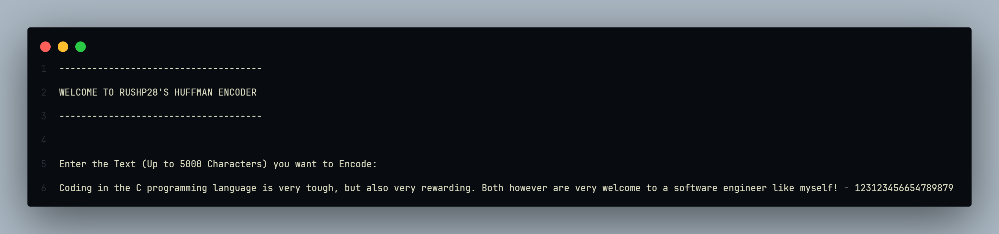
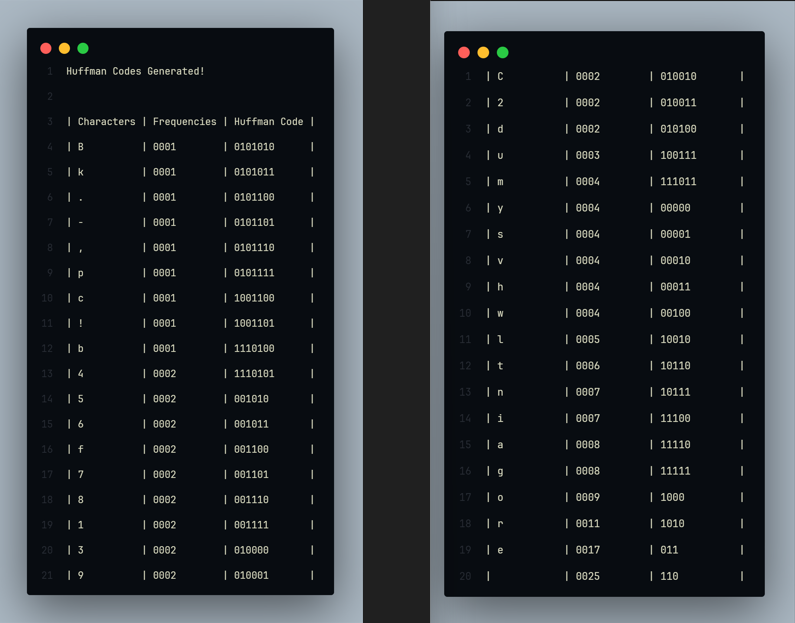
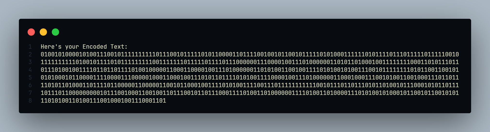

    

  

    
    
Huffman Encoder is a robust application designed to compress text using the Huffman encoding algorithm. This application leverages the power of Dictionaries, Linear Linked List Queues, Huffman Coding Tree data structures and the Huffman encoding algorithm to efficiently handle operations such as generation of Huffman code for each character and encoding of the text using Huffman codes. This project serves as a practical implementation of Data Structures and Algorithms, demonstrating the utility of the Huffman encoding algorithm in real-world applications.

 

    
    
    

        
    

     
    
    

        
    

     
    
    

        
    

 

    
    <ul>
        <li>Programming Language: C</li>
        <li>Build System: CMake</li>
        <li>Version Control: Git</li>
        <li>Programming Paradigm(s): Procedural, Object-Oriented</li>
    </ul>

 

    

    
    <ul>
        <li>None</li>
    </ul>
    
    <ol>
        <li>Clone the repository to your local computer.</li>
        <li>Navigate to "m2.exe" on the "cmake-build-debug" folder and run it.</li>
    </ol>

 

    
    
Thank you for checking out my project! In case of any feedback on the project please contact me.

